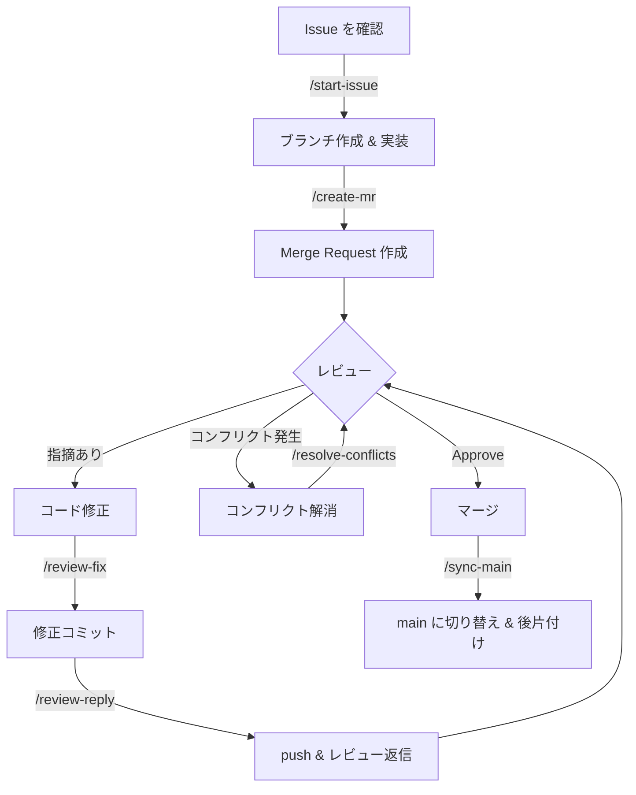

# gitlab-workflow

GitLabを使用した開発ワークフローを支援するClaude Codeプラグインです。Issueの着手からMerge Requestの作成・レビュー対応・マージ後の後片付けまで、一連の開発フローをスラッシュコマンドでサポートします。

## インストール

```bash
# マーケットプレイスを追加する（未追加の場合）
claude plugin marketplace add backpaper0/claude-plugins

# プラグインをインストールする
claude plugin install gitlab-workflow@urgm-plugins

# 必要に応じて glab（GitLab CLI）をインストールする
mise use glab
```

## 前提条件

- **Git** がインストールされていること
- **[glab](https://gitlab.com/gitlab-org/cli)** （GitLab CLI）がインストールされ、認証済みであること（`mise use glab` でのインストールを推奨）
- ブランチ戦略: `main` ブランチをメインラインとし、機能単位でフィーチャーブランチを作成します

## glab のセットアップ（セルフホスト GitLab 向け）

### 1. インストール

```bash
# mise を使用する場合（推奨）
mise use glab
```

### 2. 認証の設定

セルフホストの GitLab インスタンスに対して認証を行います。

```bash
glab auth login --hostname gitlab.example.com
```

対話形式で以下を入力します:

- **プロトコル**: HTTPS（推奨）または SSH
- **認証方法**: Personal Access Token を選択
- **トークン**: GitLab で発行したトークンを貼り付け

### 3. Personal Access Token の発行

GitLab の **Settings > Access Tokens** からトークンを発行します。

- **Token name**: 任意（例: `glab-cli`）
- **Scopes**: 以下を選択
  - `api` — MR の作成・レビューコメントの取得・返信に必要
  - `read_repository` — リポジトリ情報の参照に必要

### 4. 設定の確認

```bash
# 認証済みホストの一覧を確認
glab auth status
```

正しく設定されていれば、ホスト名・ユーザー名・トークンのステータスが表示されます。

### 複数インスタンスの利用

複数の GitLab インスタンスを使い分ける場合は、それぞれに対して `glab auth login` を実行します。glab はリポジトリの `origin` リモート URL から自動的に対応するホストの認証情報を使用します。

```bash
glab auth login --hostname gitlab.example.com
glab auth login --hostname gitlab.another.com
```

## 開発フロー



### 典型的な流れ

1. **Issue の着手** — `/start-issue` でIssueの内容を確認し、フィーチャーブランチを作成して実装を開始します
2. **MR の作成** — 実装が完了したら `/create-mr` で変更内容からタイトル・説明を自動生成してMerge Requestを作成します
3. **レビュー対応** — レビューコメントを受けたら `/review-fix` でコメントに沿ってコードを修正します
4. **レビュー返信** — 修正が完了したら `/review-reply` でpushし、各コメントスレッドに対応内容を返信します
5. **コンフリクト解消** — コンフリクトが発生した場合は `/resolve-conflicts` で対話的に解消します
6. **後片付け** — MRがマージされたら `/sync-main` でmainブランチに切り替え、マージ済みブランチを削除します

## コマンド一覧

### `/start-issue` — Issue から実装を開始

GitLab Issueの内容を読み取り、フィーチャーブランチを作成して実装を開始します。

```
/start-issue <issue番号>
```

- Issueの内容を分析し、実装すべき内容を整理して提示します
- ブランチ名を `feature/<iid>-<title-slug>` の形式で自動生成します
- `origin/main` から新しいブランチを作成します
- コードベースを調査し、実装方針をユーザーに確認してから着手します

### `/create-mr` — Merge Request を作成

現在のブランチの変更内容を分析し、GitLabにMerge Requestを作成します。

```
/create-mr
```

- コミット履歴とdiffからMRのタイトル・説明を自動生成します
- 未プッシュの場合は自動でリモートにpushします
- ターゲットブランチはデフォルトで `main` です

### `/review-fix` — レビューコメントに対応

MRのレビューコメントを取得し、ひとつずつコードを修正します。

```
/review-fix
```

- 現在のブランチに紐づくMRのレビューコメント（DiffNote）を取得します
- コメントごとに該当コードを確認し、修正を行います
- 意図が不明なコメントには返信で確認します
- 1コメント1コミットを原則とします

### `/review-reply` — 修正を push してレビューに返信

`/review-fix` でコード修正を行った後に使用します。変更をpushし、各レビューコメントのスレッドに対応内容を返信します。

```
/review-reply
```

- 未pushのコミットとレビューコメントを分析し、対応関係を推定します
- 対応付けをユーザーに確認してからpush・返信を行います
- 返信にはコミットハッシュを含めます

### `/resolve-conflicts` — コンフリクトを解消

MRのターゲットブランチとのコンフリクトを検出し、対話的に解消します。

```
/resolve-conflicts
```

- ターゲットブランチとのマージを試行し、コンフリクトを検出します
- コンフリクトファイルごとに解消方針（統合 / HEAD優先 / ターゲット優先 / 手動調整）を提示します
- ユーザーの承認を得てから解消を適用します

### `/sync-main` — main に切り替えて最新化

MRがマージされた後の後片付けを行います。mainブランチに切り替えて最新化し、マージ済みブランチを削除します。

```
/sync-main
```

- mainブランチに切り替えて `git pull` で最新化します
- マージ済みのローカルブランチをリストアップし、ユーザーの確認を得て削除します
- 強制削除（`-D`）は使用しません
